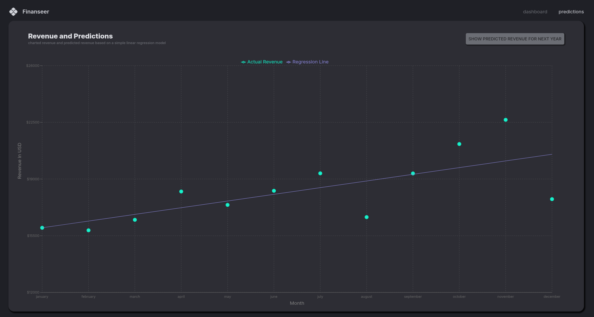

# Finanseer - Finance Dashboard Application

A comprehensive financial dashboard application built with React, TypeScript, and Node.js that provides real-time insights into revenue, expenses, products, and transactions. The application features interactive charts, data tables, and predictive analytics using linear regression models.

## 📸 Screenshots

### Main Dashboard


The main dashboard provides a comprehensive overview of your financial data through multiple visualization panels:

- **Revenue and Expenses Chart (Top Left)**: Displays a dual-line area chart showing revenue (top line) and expenses (bottom line) trends over time, with gradient fills for better visual distinction.

- **Profit and Revenue Chart (Top Middle)**: A line chart comparing profit and revenue metrics side-by-side, allowing you to track profitability trends throughout the year.

- **Revenue Month by Month (Top Right)**: A bar chart visualization showing monthly revenue breakdown, making it easy to identify peak revenue periods.

- **Operational vs Non-Operational Expenses (Middle Left)**: Dual-axis line chart comparing operational and non-operational expenses, helping identify cost structure patterns.

- **Campaigns and Targets (Middle Middle)**: Features a donut chart showing target sales progress (83% completion), along with key metrics including revenue losses (down 25%) and profit margins (up 30% from last month).

- **Product Prices vs Expenses (Middle Right)**: A scatter plot analysis showing the relationship between product prices and expenses, useful for pricing strategy optimization.

- **List of Products (Bottom Left)**: Data grid displaying all products with their IDs, expenses, and prices, showing 124 total products.

- **Recent Orders (Bottom Middle)**: Transaction table showing the 50 most recent orders with buyer information, amounts, and product counts.

- **Expenses Breakdown by Category (Bottom Right, Top)**: Four donut charts representing expense categories (salaries, supplies, services, and others) with proportional visualizations.

- **Overall Summary (Bottom Right, Bottom)**: Summary panel with progress indicators and explanatory text.

### Revenue and Predictions



The predictions page features advanced analytics capabilities:

- **Revenue Visualization**: Interactive line chart displaying actual revenue data points throughout the year.

- **Regression Analysis**: A regression line overlay showing the trend analysis of revenue patterns, calculated using linear regression algorithms.

- **Future Predictions**: Toggle button to show predicted revenue for the next year based on historical data trends. The predictions are displayed as a dashed line extending beyond the current data range.

- **Statistical Insights**: The chart includes labeled axes (Month and Revenue in USD) and a legend distinguishing between actual revenue, regression line, and predicted revenue.

## 🛠️ Technologies & Libraries

### Frontend

- **React 18.3.1** - Modern UI library for building interactive user interfaces
- **TypeScript 5.6.2** - Type-safe JavaScript for better code quality and developer experience
- **Vite 6.0.5** - Fast build tool and development server
- **Material-UI (MUI) 6.4.2** - Comprehensive React component library for rapid UI development
  - `@mui/material` - Core components
  - `@mui/icons-material` - Icon library
  - `@mui/x-data-grid` - Advanced data grid component
- **Recharts 2.15.1** - Composable charting library built on React components
- **Redux Toolkit 2.5.1** - State management with RTK Query for API calls
- **React Router DOM 6.28.2** - Client-side routing
- **Regression 2.0.1** - Linear regression library for predictive analytics

### Backend

- **Node.js** - JavaScript runtime environment
- **Express 4.21.2** - Web application framework
- **MongoDB with Mongoose 8.9.5** - NoSQL database and ODM
- **Mongoose-Currency 0.3.0** - Currency type support for Mongoose schemas
- **CORS 2.8.5** - Cross-Origin Resource Sharing middleware
- **Helmet 8.0.0** - Security middleware for HTTP headers
- **Morgan 1.10.0** - HTTP request logger
- **Body-Parser 1.20.3** - Request body parsing middleware
- **Dotenv 16.4.7** - Environment variable management
- **Nodemon 3.1.9** - Development server with auto-restart

## 📁 Project Structure

```
finance-dashboard-app/
├── client/                 # Frontend React application
│   ├── src/
│   │   ├── components/     # Reusable UI components
│   │   │   ├── BoxHeader.tsx
│   │   │   ├── DashboardBox.tsx
│   │   │   └── FlexBetween.ts
│   │   ├── scenes/         # Page components
│   │   │   ├── dashboard/  # Main dashboard views
│   │   │   │   ├── index.tsx
│   │   │   │   ├── Row1.tsx
│   │   │   │   ├── Row2.tsx
│   │   │   │   └── Row3.tsx
│   │   │   ├── navbar/     # Navigation component
│   │   │   └── predictions/ # Predictions page
│   │   ├── state/          # State management
│   │   │   ├── api.ts      # RTK Query API configuration
│   │   │   └── types.ts    # TypeScript interfaces
│   │   ├── theme.ts        # Material-UI theme configuration
│   │   └── App.tsx         # Main application component
│   └── package.json
├── server/                 # Backend Node.js application
│   ├── data/               # Seed data
│   │   └── data.js
│   ├── models/             # Mongoose models
│   │   ├── KPI.js
│   │   ├── Product.js
│   │   └── Transaction.js
│   ├── routes/             # API route handlers
│   │   ├── kpi.js
│   │   ├── product.js
│   │   └── transaction.js
│   ├── index.js            # Server entry point
│   └── package.json
├── docs/                   # Documentation
│   └── images/             # Screenshots
└── package.json            # Root package configuration
```

## 🔄 Application Flow

### Data Flow Architecture

1. **Database Layer (MongoDB)**
   - Stores three main collections: KPIs, Products, and Transactions
   - Uses Mongoose schemas with currency type support
   - Data includes monthly/daily financial metrics, product information, and transaction records

2. **Backend API (Express + Node.js)**
   - RESTful API endpoints:
     - `GET /kpi/kpis` - Retrieve KPI data
     - `GET /product/products` - Retrieve product data
     - `GET /transaction/transactions` - Retrieve transaction data (limited to 50, sorted by date)
   - Middleware stack:
     - CORS enabled for cross-origin requests
     - Helmet for security headers
     - Morgan for request logging
     - Body parser for JSON/URL-encoded data

3. **State Management (Redux Toolkit + RTK Query)**
   - Centralized state management using Redux Toolkit
   - RTK Query for efficient API data fetching and caching
   - Automatic cache invalidation and refetching
   - Type-safe API hooks generated automatically

4. **Frontend Components (React + TypeScript)**
   - **Dashboard Page**: 
     - Row1: Revenue/Expenses, Profit/Revenue, Monthly Revenue charts
     - Row2: Operational expenses, Campaigns, Product price analysis
     - Row3: Product list, Recent orders, Expense categories, Summary
   - **Predictions Page**: 
     - Revenue trend analysis
     - Linear regression calculations
     - Future revenue predictions

5. **Data Visualization (Recharts)**
   - Area charts for revenue/expense trends
   - Line charts for profit analysis
   - Bar charts for monthly comparisons
   - Scatter plots for price/expense relationships
   - Pie/Donut charts for category breakdowns
   - Responsive containers for adaptive sizing

### User Interaction Flow

1. **Application Load**
   - React app initializes with Redux store
   - RTK Query automatically fetches data from API endpoints
   - Components render with loading states, then display data

2. **Dashboard Navigation**
   - User can navigate between Dashboard and Predictions pages
   - Data is cached by RTK Query, reducing unnecessary API calls
   - Charts update reactively when data changes

3. **Predictions Analysis**
   - User toggles prediction view
   - Regression library calculates linear regression from historical data
   - Predicted revenue line extends 12 months into the future
   - Visual distinction between actual, regression, and predicted data

## 🚀 Installation & Setup

### Prerequisites

- Node.js (v14 or higher)
- MongoDB (local or cloud instance like MongoDB Atlas)
- npm or yarn package manager

### Environment Variables

Create a `.env` file in the `server` directory:

```env
MONGO_URL=your_mongodb_connection_string
PORT=5000
NODE_ENV=development
```

Create a `.env` file in the `client` directory:

```env
VITE_BASE_URL=http://localhost:5000
```

### Installation Steps

1. **Clone the repository**
   ```bash
   git clone <repository-url>
   cd finance-dashboard-app
   ```

2. **Install root dependencies**
   ```bash
   npm install
   ```

3. **Install client dependencies**
   ```bash
   cd client
   npm install
   cd ..
   ```

4. **Install server dependencies**
   ```bash
   cd server
   npm install
   cd ..
   ```

5. **Seed the database** (optional)
   - Uncomment the data insertion lines in `server/index.js` (lines 61-64)
   - Run the server once to populate the database
   - Comment them again to avoid duplicate data

6. **Start the development servers**

   **Terminal 1 - Backend Server:**
   ```bash
   cd server
   npm run dev
   ```

   **Terminal 2 - Frontend Client:**
   ```bash
   cd client
   npm run dev
   ```

7. **Access the application**
   - Frontend: http://localhost:5173 (or the port shown in terminal)
   - Backend API: http://localhost:5000

## 📊 Features

- **Real-time Financial Dashboard**: Comprehensive view of revenue, expenses, and profits
- **Interactive Charts**: Multiple chart types for different data visualizations
- **Product Management**: View and analyze product pricing and expenses
- **Transaction Tracking**: Monitor recent orders and transactions
- **Predictive Analytics**: Linear regression-based revenue predictions
- **Responsive Design**: Adapts to different screen sizes
- **Dark Theme**: Modern dark UI theme for better visual experience
- **Data Grids**: Sortable and filterable data tables for products and transactions

## 🔧 Development

### Available Scripts

**Root:**
- `npm run dev` - Start backend server with nodemon
- `npm start` - Start production server
- `npm run build` - Build client for production

**Client:**
- `npm run dev` - Start Vite development server
- `npm run build` - Build for production
- `npm run preview` - Preview production build
- `npm run lint` - Run ESLint

**Server:**
- `npm run dev` - Start server with nodemon (auto-restart)
- `npm start` - Start production server

## 🎨 Customization

### Theme Configuration

The application theme can be customized in `client/src/theme.ts`. The theme includes:
- Color palette (primary, secondary, tertiary, grey)
- Typography settings
- Component overrides

### Adding New Charts

1. Create a new component in the appropriate `Row` file
2. Use Recharts components within a `ResponsiveContainer`
3. Fetch data using RTK Query hooks
4. Add the component to the dashboard grid layout

## 📝 Notes

- The application uses MongoDB for data persistence
- Currency values are stored as integers (cents) and converted to dollars using Mongoose getters
- RTK Query automatically handles caching and refetching
- The predictions feature uses simple linear regression; for production, consider more advanced ML models
- Ensure MongoDB is running before starting the server

## 🤝 Contributing

Contributions are welcome! Please feel free to submit a Pull Request.

## 📄 License

ISC

---

Built with ❤️ using React, TypeScript, and Node.js
